[](https://travis-ci.org/grburgess/cosmogrb)
[](https://codecov.io/gh/grburgess/cosmogrb)

# cosmogrb

## Idea
This simulates a cosmological population of **GRBs** in the Universe from a given space and luminosity distribution.

### Light curves / lightcurves

After simulation, a realistic background and temporally evolving spectrum are created. These are then sampled at the single photon level, pushed through the detector responses, simulated with real dead time, and pushed into FITS Event files. 

Cool?

```python

import matplotlib.pyplot as plt
%matplotlib inline

import cosmogrb
```

# Demo of Creating a GBM GRB

## Instantiate the GRB with its parameters


```python
grb = cosmogrb.GBMGRB_CPL(
    ra=312.0,
    dec=-62.0,
    z=1.0,
    peak_flux=5e-7,
    alpha=-0.66,
    ep=500.0,
    tau=2.0,
    trise=1.0,
    duration=20.0,
    T0=0.1,
)
```

## Examine the latent lightcurve


```python
time = np.linspace(0, 100, 50)

grb.display_energy_integrated_light_curve(time);


```


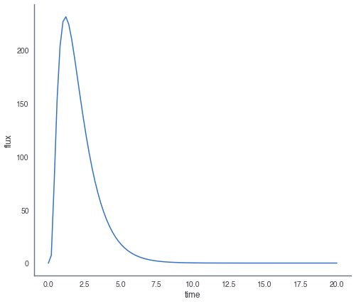


```python
energy = np.logspace(1, 3, 100)

grb.display_energy_dependent_light_curve(time, energy, cmap='magma')
```


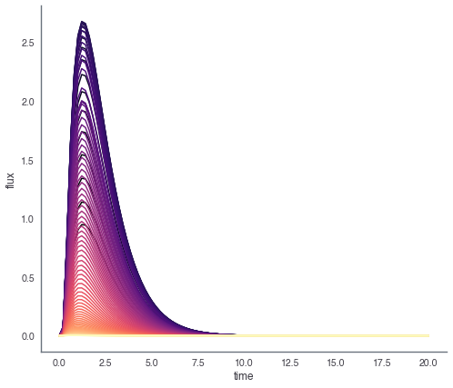


## Simulate the GRB 


```python
grb.go(n_cores=6)
```

## Save the GRB to an HDF5 file


```python
grb.save('test_grb.h5')
```

## Reload the GRB


```python
grb_reload = cosmogrb.GRBSave.from_file('test_grb.h5')
```


```python
for key in grb_reload.keys:
    fig, ax = plt.subplots()
    
    lightcurve = grb_reload[key]['lightcurve']
    
    lightcurve.display_lightcurve(ax=ax)
    lightcurve.display_source(ax=ax)
    lightcurve.display_background(ax=ax)
```


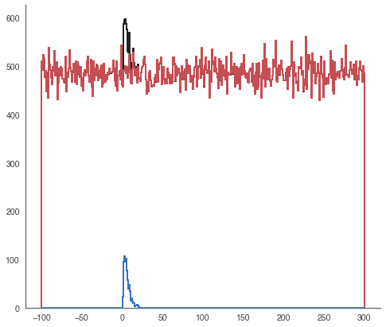


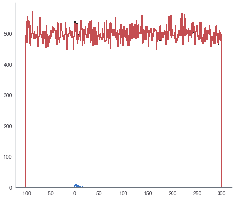


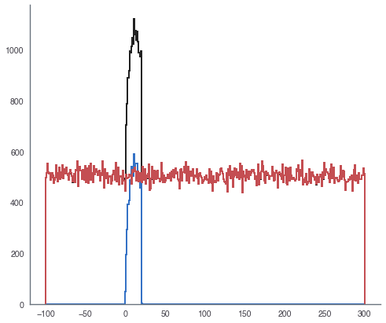


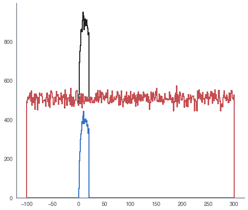


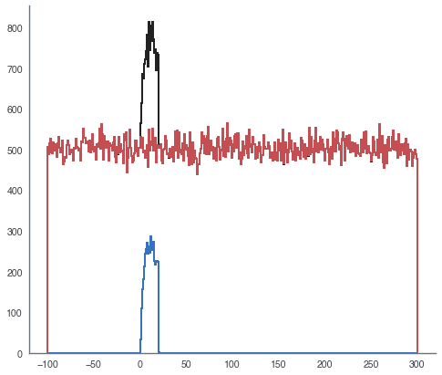


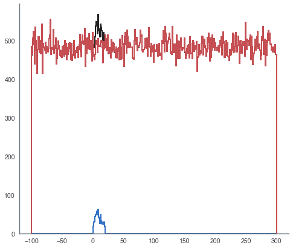


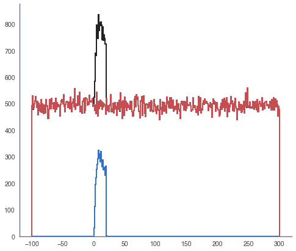


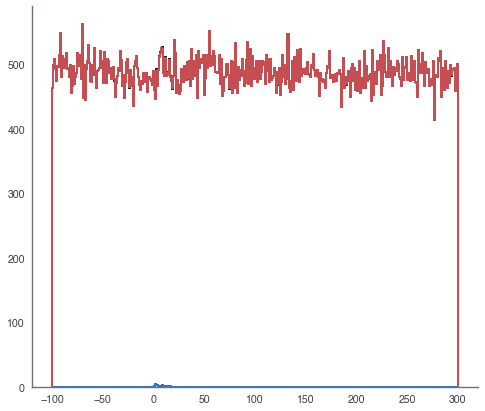


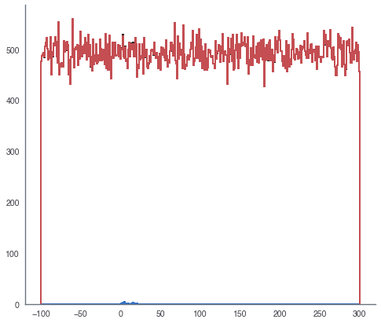


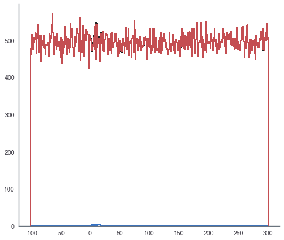


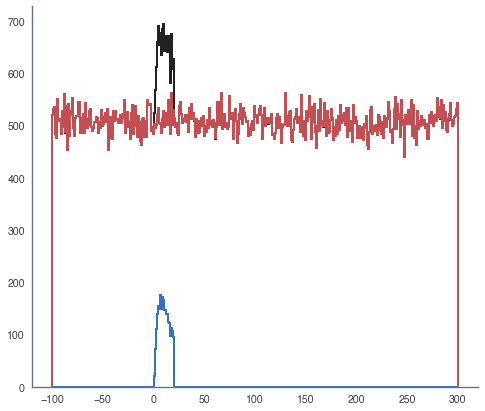


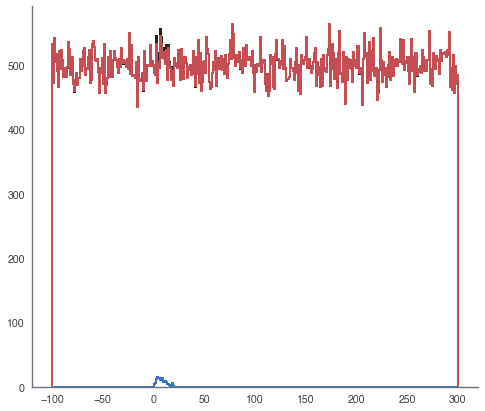


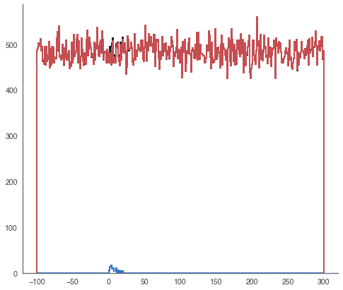


## Convert HDF5 to standard FITS files 


```python
cosmogrb.grbsave_to_gbm_fits("test_grb.h5")
!ls SynthGRB_*
```

    SynthGRB_b0.fits      SynthGRB_n3.fits      SynthGRB_n7rsp_n7.rsp
    SynthGRB_b0.rsp       SynthGRB_n3.rsp       SynthGRB_n8.fits
    SynthGRB_b0rsp_b0.rsp SynthGRB_n3rsp_n3.rsp SynthGRB_n8.rsp
    SynthGRB_b1.rsp       SynthGRB_n4.fits      SynthGRB_n8rsp_n8.rsp
    SynthGRB_b1rsp_b1.rsp SynthGRB_n4.rsp       SynthGRB_n9.fits
    SynthGRB_n0.fits      SynthGRB_n4rsp_n4.rsp SynthGRB_n9.rsp
    SynthGRB_n0.rsp       SynthGRB_n5.fits      SynthGRB_n9rsp_n9.rsp
    SynthGRB_n0rsp_n0.rsp SynthGRB_n5.rsp       SynthGRB_na.fits
    SynthGRB_n1.fits      SynthGRB_n5rsp_n5.rsp SynthGRB_na.rsp
    SynthGRB_n1.rsp       SynthGRB_n6.fits      SynthGRB_narsp_na.rsp
    SynthGRB_n1rsp_n1.rsp SynthGRB_n6.rsp       SynthGRB_nb.fits
    SynthGRB_n2.fits      SynthGRB_n6rsp_n6.rsp SynthGRB_nb.rsp
    SynthGRB_n2.rsp       SynthGRB_n7.fits      SynthGRB_nbrsp_nb.rsp
    SynthGRB_n2rsp_n2.rsp SynthGRB_n7.rsp


```python

```
