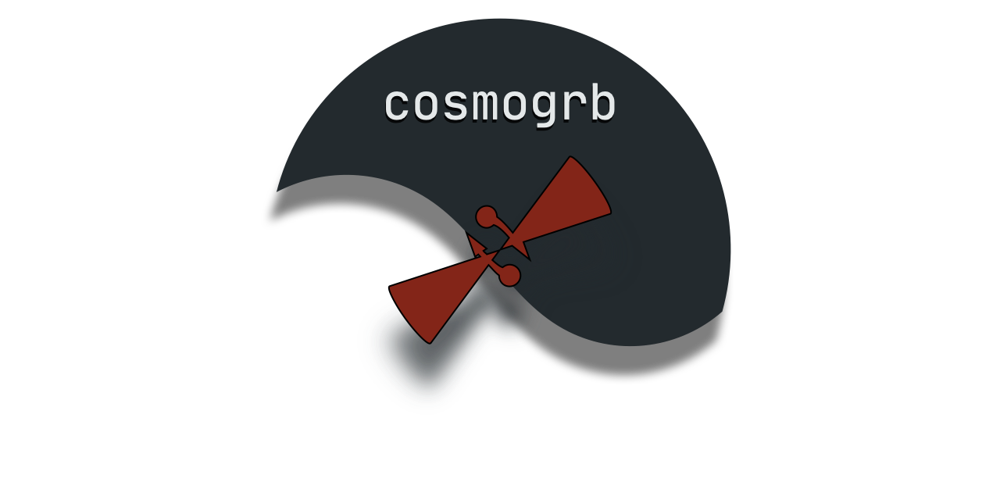

.. cosmogrb documentation master file, created by
   sphinx-quickstart on Mon Aug 19 11:40:04 2019.
   You can adapt this file completely to your liking, but it should at least
   contain the root `toctree` directive.

Welcome to cosmogrb's documentation!
====================================
**cosmogrb** is a package built upon `popsynth <https://popsynth.readthedocs.io/en/latest/>`_ to simulate GRBs from luminosity functions and various other distributions. Each GRB can be passed through an instrument's response resulting in data when can be later analyzed (preferably with `3ML <https://threeml.readthedocs.io/en/latest/)>`_. Thus, one can generate catalogs of data from theoretical assumptions an test what these assumptions lead to in terms of observation. 

The code is currently in *alpha* so do not expect too much use out of it. 

.. toctree::
   :maxdepth: 5

   notebooks/intro.ipynb

   
.. nbgallery::
   :caption: Features and examples:

   notebooks/grb.ipynb
   notebooks/universe.ipynb

   
   
Indices and tables
==================

* :ref:`genindex`
* :ref:`modindex`
* :ref:`search`
